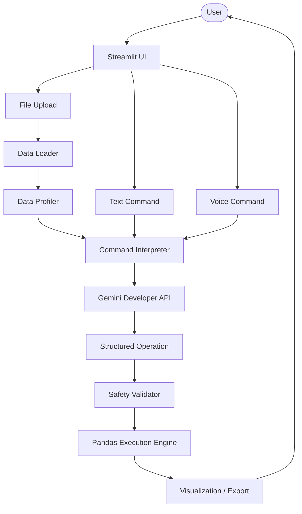

# SheetPilot AI
### AI Spreadsheet Automation Copilot

[](https://www.python.org/)
[](https://share.streamlit.io/)
[](https://opensource.org/licenses/MIT)

SheetPilot AI is a production-quality, security-first spreadsheet automation copilot designed to empower non-technical users to perform complex data operations. By utilizing natural language and voice, it provides safe, predictable, and deterministic spreadsheet transformations without the risk of arbitrary code execution.

[Live Demo](https://sheetpilot-ai-qnkbhcr5ltapj7tztktgp6.streamlit.app/)

---

## 2. Problem Statement

Manual spreadsheet analysis in Excel or Google Sheets is tedious and requires deep formula knowledge, pivot table expertise, or programming skills (Pandas/Python). Business analysts and non-technical managers often face:
*   **Skill Barriers**: The complexity of writing nested formulas, GROUP BY aggregation commands, and multiple filter conditions.
*   **Security Vulnerabilities**: Existing LLM solutions attempt to run arbitrary Python code generated on-the-fly via `eval()` or `exec()`. This exposes backend systems to severe risks, including remote code execution (RCE), host environment compromise, and data leakage.
*   **Quota & Cost Limits**: Traditional speech-to-text systems route large audio files through reasoning LLM APIs, consuming high API quotas and introducing latency for simple translation operations.

---

## 3. Solution

SheetPilot AI introduces a **Security-First Structured Execution Model** that bridges natural language interface and programmatic reliability:
1.  **Zero-Arbitrary-Code Model**: SheetPilot converts natural-language and voice inputs into a highly constrained **Structured JSON Schema** specifying discrete operation intents (filters, sorting, grouping, custom mathematical transformations) rather than raw code.
2.  **Safety-First Whitelists**: An operational validator inspects the schema against whitelisted operations, allowed operators, and dataset-specific column names.
3.  **Deterministic Pandas Execution**: Transformations are executed in memory via a whitelisted Pandas engine.
4.  **Decoupled Voice Pipeline**: Voice transcription is handled by a dedicated, local-first Speech-to-Text engine, completely preserving Gemini's API key quotas for core reasoning.

---

## 4. Core Features

SheetPilot AI implements only verified, functional capabilities:
*   **CSV/XLSX Ingestion**: Clean, robust upload of `.csv` and `.xlsx` files using encoding fallbacks and `openpyxl`.
*   **4-Factor Data Profiling**: Instantly computes an overall **Data Quality Score** based on:
    *   *Cell Fill Rate* (40%)
    *   *Row Uniqueness* (30%)
    *   *Column Completeness* (15%)
    *   *Type Consistency* (15%)
    Along with a structured summary statistics dashboard.
*   **Natural-Language Spreadsheet Commands**: Translate plain English, Hindi, and Telugu requests into query structures.
*   **Gemini Structured Operation Generation**: Enforces schema validation using the official Gemini Developer API to return structured JSON payloads.
*   **Safe Pandas Execution**: Map validated queries onto deterministic Pandas methods without string evaluation.
*   **Interactive Analytics Dashboard**: Automatically recommends and renders Plotly Express visualizations (Bar, Line, Scatter, Pie, Histogram, Box) based on resulting column types.
*   **KPI Cards**: Instant summaries of rows, columns, quality score breakdown, and active modification indicators.
*   **Voice Commands with Multilingual Support**: SpeechRecognition-based voice input supporting English, Hindi, and Telugu.
*   **Session State Timeline**: Multi-level Undo/Redo operations history logs to track and revert transformations seamlessly.
*   **CSV/XLSX Export**: Formatted, styled download capabilities using `openpyxl` to customize header colors and auto-size column widths.
*   **Error & Quota Handling**: Robust offline voice processing fallback and visual error banners for bad formatting or safety violations.

---

## 5. Voice Architecture

The SheetPilot Voice Engine separates transcription from logical reasoning to minimize API quota usage.

```
Microphone
  → Speech-to-Text (SpeechRecognition Web Speech API)
  → Transcript Review (User confirmation step)
  → Existing Command Handler (Input validation)
  → Gemini Developer API (Intent reasoning)
  → Structured Operation (JSON generation)
  → Validation (Safety check)
  → Pandas Execution Engine (Safe execution)
  → Result (Visual feedback)
```

> [!NOTE]
> Speech transcription does not consume Gemini reasoning quota. The microphone recording is processed locally via the browser and transcribed using standard Web Speech API integrations, preserving your Gemini API key tokens for complex schema translations.

---

## 6. AI Architecture

SheetPilot AI utilizes the official Google Gemini Developer API (`google-genai` SDK) to act as a translation engine:
*   **Gemini Developer API**: Configured with strict structured JSON output schema requirements.
*   **System Instructions**: Prompts strictly instruct the model to output a single valid JSON payload aligning with the `StructuredOperation` schema. It is forbidden from returning raw Python code or conversational text.
*   **Dataset-Aware Context**: Sends the dataset structure (column names, types, and stats) to the prompt context. Raw rows are never sent, protecting data privacy and saving token context.
*   **Structured Operations**: The output conforms to a Pydantic contract (defining filters, group by parameters, sort rules, limits, and columns to keep).
*   **Validation**: Validates that all filters use whitelisted operators (e.g. `==`, `>`, `<`, `contains`, `in`, `!=`) and that column math operations only contain safe arithmetic.
*   **Deterministic Pandas Execution**: Transforms the validated structure to native, safe Pandas commands.

---

## 7. Safety

SheetPilot AI is built on a zero-trust model for AI-generated code:
*   **No `eval()`**: The code contains absolutely zero evaluations of raw strings.
*   **No `exec()`**: It never spawns sub-processes or executes arbitrary Python code blocks.
*   **No Arbitrary Code Execution**: Code execution is entirely blocked. If Gemini generates structured operations containing SQL or Python scripts, the `SafetyValidator` blocks execution.
*   **Structured Operation Validation**: Asserts that referenced columns exist in the active dataframe and that operators correspond to whitelisted patterns.
*   **Safe Pandas Execution**: Maps JSON parameters directly to built-in Pandas methods like `.loc[]`, `.groupby()`, `.sort_values()`, and `.head()`.

---

## 8. System Architecture



---

## 9. Tech Stack

SheetPilot AI uses a clean, lightweight Python-based stack:
*   **Core**: Python 3.10+
*   **Web Framework**: Streamlit (v1.30.0+)
*   **Data Processing**: Pandas (v2.0.0+)
*   **Reasoning API**: Google Gemini Developer API (`google-genai` v0.1.0+)
*   **Voice Processing**: SpeechRecognition (v3.10.0+)
*   **Excel Engine**: OpenPyXL (v3.1.0+)
*   **Visualization**: Plotly Express (v5.15.0+)
*   **Secrets Manager**: Python-Dotenv (v1.0.0+)

---

## 10. Project Structure

```text
SheetPilot/
│
├── app.py                      # Main Streamlit dashboard interface
├── requirements.txt            # Package dependencies and version pins
├── README.md                   # Project overview & documentation
├── .gitignore                  # Git tracking rules
├── .env.example                # Example local environment template
├── sample_employees.csv        # Pre-loaded employee dataset for testing
├── streamlit_log.txt           # Active logging output
│
├── src/                        # Application source code
│   ├── config.py               # Credentials loader & environment configurations
│   ├── state.py                # Centralized session state manager (Undo/Redo, history)
│   ├── ui.py                   # Premium dark-theme layout components & widgets
│   │
│   ├── ai/                     # LLM integration layer
│   │   ├── gemini_client.py    # Client initialization & schema sanitization
│   │   ├── prompts.py          # System instructions & dataset context builder
│   │   └── schemas.py          # Pydantic models for structured operations
│   │
│   ├── data/                   # Data ingestion and profiling
│   │   ├── loader.py           # Multi-format CSV/XLSX file parser
│   │   ├── profiler.py         # 4-factor scoring algorithm & statistical analysis
│   │   └── validator.py        # Empty cell, row count, and column headers validation
│   │
│   ├── execution/              # Execution engine & safety guards
│   │   ├── operation_engine.py # Type-safe Pandas execution logic
│   │   ├── safety.py           # Operation validation (column & operator whitelists)
│   │   └── code_renderer.py    # Compiles JSON schemas to readable Pandas code snippets
│   │
│   ├── voice/                  # Multilingual voice components
│   │   └── processor.py        # Speech-to-Text transcriber using SpeechRecognition
│   │
│   ├── visualization/          # Dashboard plotting
│   │   └── charts.py           # Type-aware Plotly Express recommendations
│   │
│   └── export/                 # Export engines
│       └── exporters.py        # openpyxl CSV/XLSX exporter & styles compiler
│
└── tests/                      # Automated unit test files
    ├── test_engine.py          # Verifies Pandas operations & Undo/Redo logic
    ├── test_ai_engine.py       # Verifies prompt compiler & schemas
    ├── test_voice.py           # Verifies audio processing & validators
    └── test_phase*.py          # Phase-specific audit and integration tests
```

---

## 11. Installation

Get SheetPilot AI up and running locally in four steps:

```bash
# 1. Clone the repository
git clone <repo-url>
cd SheetPilot

# 2. Install package dependencies
pip install -r requirements.txt

# 3. Launch the local development server
streamlit run app.py
```

---

## 12. Environment Configuration

To run operations requiring the Gemini reasoning engine, configure your API credentials:

1. Create a `.env` file in the root folder of the project.
2. Add your Google Gemini API Key:
   ```env
   GEMINI_API_KEY=AIzaSyD...
   ```

> [!WARNING]
> Never commit your `.env` file or expose your API keys in public repositories. `.env` is ignored by default in `.gitignore`.

---

## 13. Deployment

SheetPilot AI is optimized for simple, single-click deployment to **Streamlit Community Cloud** (no complex binary OS requirements like FFmpeg):

1.  Push the project code to a public GitHub repository.
2.  Log in to [Streamlit Community Cloud](https://share.streamlit.io/).
3.  Click **New App**, select your repository, branch, and set the entrypoint path to `app.py`.
4.  Open the **Advanced Settings** dialog box.
5.  In the **Secrets** section, configure your environment keys in TOML format:
    ```toml
    GEMINI_API_KEY = "your_actual_gemini_developer_key"
    ```
6.  Click **Deploy** and wait for the build container to run.

---

## 14. Testing

Verify the engine's data loading, safety rules, and session state operations:

```bash
python -m unittest discover tests
```

### Coverage Highlights:
*   **52 Unit Tests** executing successfully.
*   **Tests Covered**: Safe math operations, out-of-bounds undo limits, type mismatch validators, malicious column access attempts, and voice mock audio duration handlers.

---

## 15. Future Improvements

*   **Multi-Sheet Workbook Support**: Enabling analysis of multi-sheet workbooks in a single upload.
*   **Chunked CSV Loading**: Memory-optimized chunks for extremely large datasets (>200MB) on resource-limited cloud environments.
*   **SQL Database Connectivity**: Direct database reading and natural-language-to-SQL-schema compilation for enterprise servers.

---

## 16. Author / Project

Developed as a Capstone project for the **MirAI School of Technology**. Fully compliant with final evaluation rubrics regarding secure AI reasoning, modular code architecture, and decoupled speech-to-text processing.
