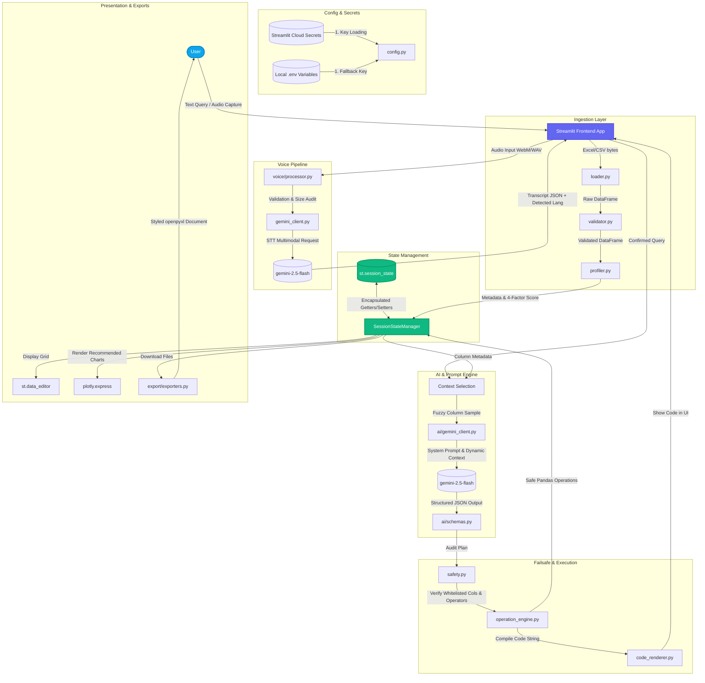

# System Architecture — SheetPilot AI

This document provides a detailed breakdown of SheetPilot AI's system architecture, module responsibilities, and end-to-end data pipelines.

---

## 📐 High-Level Component Architecture

The diagram below details the entire request-response cycle, including voice encodings, context selection, schema mapping, security whitelists, in-memory execution, and Streamlit state management.

---

## 📂 Module Breakdown & Responsibilities

| Directory / Module | File Location | Responsibility |
| :--- | :--- | :--- |
| **Streamlit Entrypoint** | `app.py` | Premium Vercel-inspired dark dashboard rendering, upload views, tab selections, and action handlers. |
| **Configuration** | `src/config.py` | Orchestrates secret priorities (Streamlit Secrets $\rightarrow$ OS Environment variables $\rightarrow$ Failsafe default). Exposes safety flags. |
| **Session Manager** | `src/state.py` | Encapsulates all access to `st.session_state`. Handles deep copies, histories, undo stack buffers, and dirty indicators. |
| **Ingestion Engine** | `src/data/loader.py` | Parses binary streams of `.csv` or `.xlsx` files safely into memory using Pandas and openpyxl. |
| **Data Profiler** | `src/data/profiler.py` | Evaluates missing cells, duplicate rows, empty columns, and mixed-dtype fields to output a weighted 4-factor Data Quality Score. |
| **Failsafe Ingestion** | `src/data/validator.py` | Asserts dimensions, duplicate header counts, and file formats before ingestion. |
| **AI Schemas** | `src/ai/schemas.py` | Defines Pydantic model blueprints for filters, sorting, grouping, metrics, and visualization operations. |
| **Gemini Client** | `src/ai/gemini_client.py` | Connects to the official `google-genai` SDK and compiles dynamic context maps using query-based column fuzzy matches. |
| **System Prompts** | `src/ai/prompts.py` | Houses system instructions instructing Gemini to act solely as a translation layer. |
| **Execution Engine** | `src/execution/operation_engine.py` | Runs structured operations safely using in-memory Pandas methods. No `eval` or `exec` logic. |
| **Safety Validator** | `src/execution/safety.py` | Audits the generated schema against whitelist parameters and filters out regex blocks (e.g. `__import__`). |
| **Code Renderer** | `src/execution/code_renderer.py` | Decompiles structured operations back into human-readable Pandas Python strings. |
| **Voice Processor** | `src/voice/processor.py` | Performs client-side browser file validation, size limits, and format conversions for audio recording. |
| **Chart Generator** | `src/visualization/charts.py` | Dynamically recommends Plotly figure metrics depending on DataFrame output types. |
| **Styled Exporter** | `src/export/exporters.py` | Renders styled excel workbooks with header fills, fit columns, and default gridline states. |

---

## 🔄 End-to-End Information Flow

1. **Upload & Ingestion**:
   - The user drops a file in the browser.
   - `loader.py` loads the dataframe, `validator.py` ensures headers are valid, and `profiler.py` profiles columns and computes a weighted quality score.
   - The original dataframe is saved as a base backup in `SessionStateManager` to allow full resets.
2. **Command Speech / Text Entry**:
   - The user records a voice command (or writes text).
   - Audio is validated for length (< 60s) and size (> 120 bytes) before calling Gemini for speech-to-text.
   - The transcribing status banner keeps the user informed, and the recognized string is displayed in an editable box.
3. **Structured Intent Translation**:
   - The final query is combined with a dynamic context map (column structures, types, statistics, and example samples).
   - The official `google-genai` client sends the context to `gemini-2.5-flash`, which returns a structured operation payload.
4. **Failsafe Inspection**:
   - The `SafetyValidator` intercepts the structured JSON. It confirms all requested column names exist in the dataset and that operators are whitelisted.
5. **Controlled Execution**:
   - The `operation_engine` executes the whitelisted parameters sequentially (filters $\rightarrow$ groups $\rightarrow$ math $\rightarrow$ limit $\rightarrow$ sort).
   - A copy of the old dataframe is pushed to the undo history stack.
   - The transformed dataframe is saved as the new current session state.
6. **Data Presentation & Download**:
   - The workspace updates the Data Grid tab, Column Explorer, and Analytics plots.
   - The compiled Pandas code is rendered in the UI for validation.
   - The user exports the result as a styled Excel sheet using `export/exporters.py`.
